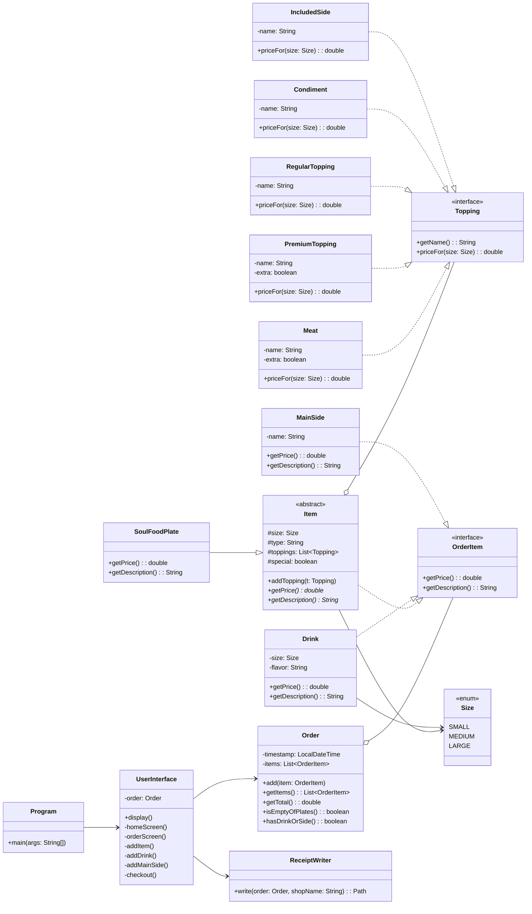

# Class Diagram — Soul Food POS

The repo README must include the class diagram (spec requirement). Embed this Mermaid in your README — GitHub renders it natively. Export a PNG too via <https://mermaid.live>.

## Why this design

- **`OrderItem` interface** — lets `Order` hold a mixed list of plates, drinks, and main sides under one type. Loose coupling.
- **`Item` abstract class** — pulls common state (size/type/toppings) out of `SoulFoodPlate`. Sets you up for **Phase 6 bonus** `SignaturePlate extends SoulFoodPlate`.
- **`Topping` interface w/ 5 implementations** — pricing rule lives inside each topping class (polymorphism). `Item.getPrice()` just iterates.
- **`Size` enum** — type-safe size carrying base price per size for plates, drinks, etc. via a method.
- **`ReceiptWriter` separated** — UI does not write files directly; matches the dealership `DealershipFileManager` / `ContractFileManager` split from Workbook 5w.
