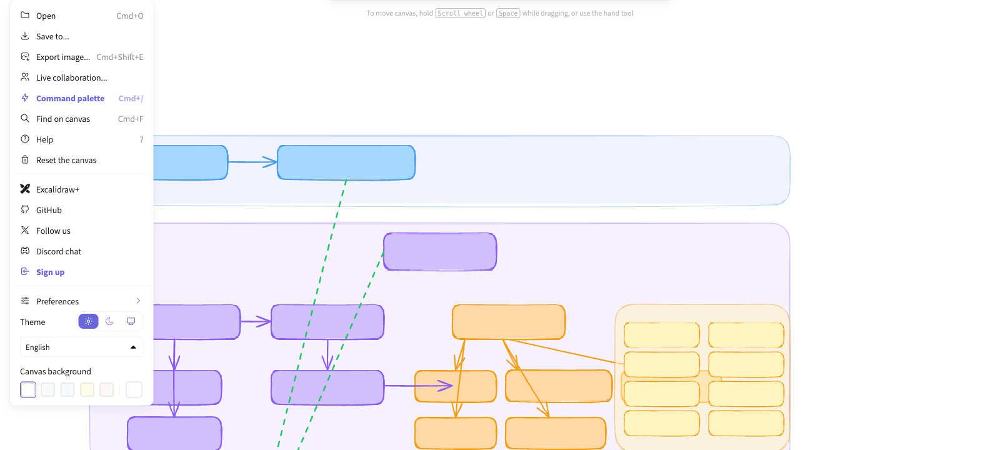

# Dorothy's Oven — Soul Food POS

A console-based point-of-sale system for Dorothy's Oven soul food restaurant, built as a Java capstone project. Customers walk through a guided menu to build a fully customized plate, add drinks and sides, and receive a timestamped receipt.

**Tech stack:** Java 17 · Amazon Corretto 17 · Maven

---

## Quick Start

```bash
mvn -q exec:java -Dexec.mainClass=com.yearup.soulfoodpos.Program
```

Or run `Program.main()` directly from IntelliJ IDEA.

Receipts are saved automatically to `data/receipts/yyyyMMdd-HHmmss.txt`.

---

## Features

| Feature | Details |
|---|---|
| Plate builder | Choose plate type, size, meats, premium toppings, regular toppings, condiments, and included sides |
| Plate types | Single Meat, Two-Meat Combo, Three-Meat Family, Family Bundle (5 meats), Sampler Plate (6 meats) |
| Make it Hot | Optional spice upgrade on any plate |
| Drinks | 3 sizes × 7 flavors |
| Main Sides | 4 shareable family-style sides ($1.50 flat) |
| Order validation | A plate-less order requires at least one drink or main side |
| Receipt output | Auto-saved to `data/receipts/` with timestamp filename |

---

## Pricing

| Component | Small | Medium | Large |
|---|---|---|---|
| Plate base (standard) | $3.50 | $9.00 | $8.50 |
| Plate base (Family Bundle) | $6.00 | $12.00 | $14.00 |
| Plate base (Sampler) | $8.00 | $15.00 | $18.00 |
| Meat | $10.00 | $12.00 | $15.00 |
| Extra Meat upgrade | +$0.50 | +$1.00 | +$1.50 |
| Premium Topping | $6.50–$9.50 | same | same |
| Extra Premium upgrade | +40% of base | same | same |
| Regular Toppings / Condiments / Included Sides | included | same | same |
| Drink | $2.00 | $2.50 | $3.00 |
| Main Side | $1.50 flat | — | — |

> The Large plate base ($8.50) being less than Medium ($9.00) matches the spec literally. Adjust the constants in `SoulFoodPlate.basePlatePrice()` if your instructor approves a correction.

---

## Full Menu

**Meats** — Fried Chicken · Ox-Tails · Fried Catfish · Smoked Turkey Leg · Pork Chops · Hot Links

**Premium Toppings** — Extra Gravy · Cornbread Dressing · Hot Water Cornbread · Honey Butter Glaze

**Regular Toppings** — Candied Yams · Cabbage · Black-Eyed Peas · Potato Salad · Coleslaw · Cornbread · Pickled Okra · Onions · Pickles

**Condiments** — Hot Sauce · BBQ Sauce · Mike's Hot Honey · Vinegar · Honey Mustard · Maple Syrup

**Included Sides** — Mac and Cheese · Red Beans · Collard Greens

**Drinks** — Sweet Tea · Lemonade · Arnold Palmer · Coca-Cola · Strawberry Soda · Grape Soda · Red Kool-Aid

**Main Sides** — Family Mac · Family Red Beans · Family Collards · Cornbread Basket

---

## Project Structure

```
src/main/java/com/yearup/soulfoodpos/
├── Program.java                        Entry point — wires UserInterface
├── model/
│   ├── Topping.java                    Interface: getName(), priceFor(Size), isExtra()
│   ├── Item.java                       Abstract base for plated items
│   ├── SoulFoodPlate.java              Plate — delegates price to each Topping
│   ├── Meat.java                       Topping impl with size-scaled pricing
│   ├── PremiumTopping.java             Topping impl with enum-driven base + 40% extra
│   ├── RegularTopping.java             Topping impl — always $0.00
│   ├── Condiment.java                  Topping impl — always $0.00
│   ├── IncludedSide.java               Topping impl — always $0.00
│   ├── Drink.java                      OrderItem with size-based price
│   ├── MainSide.java                   OrderItem — flat $1.50
│   ├── Order.java                      Cart: holds OrderItems, computes total
│   ├── OrderItem.java                  Interface: getDescription(), getPrice()
│   └── enums/
│       ├── PlateType.java              Enum with label + meatSlots capacity
│       ├── Size.java                   SMALL / MEDIUM / LARGE
│       ├── MeatOption.java             6 meat variants
│       ├── PremiumToppingOption.java   4 premium options with individual prices
│       ├── RegularToppingOption.java   9 options
│       ├── CondimentOption.java        6 condiments
│       ├── IncludedSideOption.java     3 included sides
│       ├── DrinkFlavor.java            7 flavors
│       └── MainSideOption.java         4 family sides
├── ui/
│   └── UserInterface.java              All console screens and ordering flow
└── io/
    └── ReceiptWriter.java              Writes timestamped receipts to data/receipts/
```

---

## Object-Oriented Design Highlights

### Topping Interface — Polymorphic Pricing

`SoulFoodPlate.getPrice()` sums a single `List<Topping>` without knowing the concrete type of each item:

```java
// SoulFoodPlate.java
public double getPrice() {
    double total = basePlatePrice();
    for (Topping t : toppings) {
        total += t.priceFor(size);   // each class owns its own pricing rule
    }
    return total;
}
```

Every topping category (`Meat`, `PremiumTopping`, `RegularTopping`, `Condiment`, `IncludedSide`) implements `priceFor(Size)` differently. Adding a new topping category in the future requires only one new class — no changes to `SoulFoodPlate`.

### Generic `addToppings` — One Method for Every Category

The entire topping selection flow (meats, premiums, regulars, condiments, included sides) runs through a single generic method:

```java
private <E extends Enum<E>> void addToppings(
    SoulFoodPlate plate,
    String label,
    E[] options,
    ToppingFactory<E> factory,
    boolean offerExtra,
    Function<E, String> priceLabel,
    int maxCount          // enforces plate-type meat slot limit; 0 = unlimited
)
```

`PlateType` carries its own `meatSlots` value (1–6), which is passed directly as `maxCount` for meat selection — the UI automatically advances when the limit is reached.

### PlateType Enum with Capacity

```java
public enum PlateType {
    SINGLE_MEAT_PLATE("Single Meat Plate", 1),
    TWO_MEAT_COMBO    ("Two-Meat Combo",    2),
    THREE_MEAT_FAMILY ("Three-Meat Family", 3),
    FAMILY_BUNDLE     ("Family Bundle",     5),
    SAMPLER_PLATE     ("Sampler Plate",     6);

    private final String label;
    private final int meatSlots;
}
```

Each plate type self-describes how many meats it supports — the enum is the single source of truth.

---

## Architecture Diagram

Interactive diagram (opens in Excalidraw):
[View on Excalidraw](https://excalidraw.com/#json=C1Wb8dlIHw1raCstm0UF6,efDN_L3AXIVuKm7vspsxJA)


