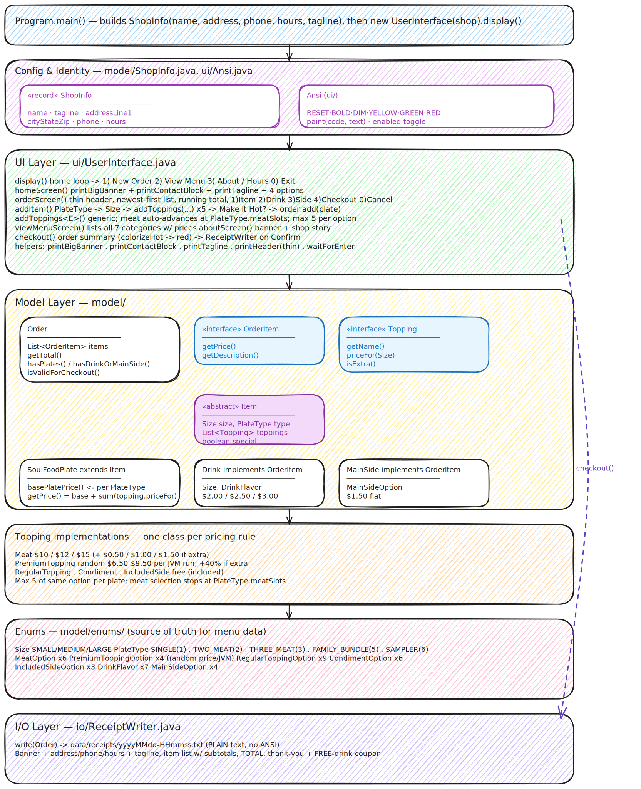

# Dorothy's Soul Bowls — Soul Food POS

A console-based point-of-sale system for **Dorothy's Soul Bowls**, a soul food
rice-bowl shop, built as a Java capstone project. A branded home screen (box-drawing
banner, address, phone, hours) leads to a guided menu where customers build a fully
customized bowl — pick a rice base, size, meats, toppings, condiments, and sides —
add drinks and a main side, browse the full menu, and receive a timestamped receipt.
Console output is colorized with ANSI when enabled.

**Tech stack:** Java 17 · Amazon Corretto 17 · Maven

---

## Location & Hours

**Dorothy's Soul Bowls** — _"Real soul food, real love."_

- 1247 Fillmore Street, San Francisco, CA 94115
- (415) 555-0184
- Tue–Sun · 11am–9pm (Closed Mon)

> Address and phone are illustrative placeholders for the capstone, defined in `ShopInfo` inside `Program.main()`.

---

## Quick Start

```bash
mvn -q exec:java -Dexec.mainClass=com.yearup.soulfoodpos.Program
```

Or run `Program.main()` directly from IntelliJ IDEA.

Receipts are saved automatically to `data/receipts/yyyyMMdd-HHmmss.txt`.

---

## Features

| Feature | Details |
|---|---|
| Bowl builder | Choose rice base, size, meats, premium toppings, regular toppings, condiments, and included sides |
| Rice bases | White Rice · Jambalaya · Brown Rice · Garlic Rice (the bowl "type") |
| Sizes | Small / Medium / Large — each size also sets how many meats the bowl holds (1 / 2 / 3) |
| Make it Hot | Optional spice upgrade on any bowl |
| Drinks | 3 sizes × 7 flavors |
| Main Sides | 4 shareable family-style sides ($1.50 flat) |
| Order validation | A bowl-less order requires at least one drink or main side |
| Receipt output | Auto-saved to `data/receipts/` with timestamp filename |
| Branded home screen | Box-drawing banner with shop name, address, phone, hours, and tagline |
| View Menu | Browse all seven categories with prices without starting an order |
| About / Hours | Shop story plus address, phone, and hours |
| Color output | ANSI color when enabled — bold shop name, green prices, red "Make it Hot"; plain when `Ansi.enabled = false` |

---

## Pricing

Prices follow the Capstone 2 "Custom Food Shop" example price sheet.

| Component | Small | Medium | Large |
|---|---|---|---|
| Bowl base (all 4 rice bases) | $3.50 | $9.00 | $8.50 |
| Meat | $1.00 | $2.00 | $3.00 |
| Extra meat upgrade | +$0.50 | +$1.00 | +$1.50 |
| Premium topping | $0.75 | $1.50 | $2.25 |
| Extra premium upgrade | +$0.30 | +$0.60 | +$0.90 |
| Regular Toppings / Condiments / Included Sides | included | included | included |
| Drink | $2.00 | $2.50 | $3.00 |
| Main Side | $1.50 flat | — | — |

> The Large bowl base ($8.50) being less than Medium ($9.00) matches the spec price
> sheet literally. Adjust the constants in `SoulFoodPlate.basePlatePrice()` if your
> instructor approves a correction.

---

## Full Menu

**Rice bases (bowl types)** — White Rice · Jambalaya · Brown Rice · Garlic Rice

**Meats** — Fried Chicken · Ox-Tails · Fried Catfish · Smoked Turkey Leg · Pork Chops · Hot Links

**Premium Toppings** — Extra Gravy · Cornbread Dressing · Hot Water Cornbread · Honey Butter Glaze

**Regular Toppings** — Candied Yams · Cabbage · Black-Eyed Peas · Potato Salad · Coleslaw · Cornbread · Pickled Okra · Onions · Pickles

**Condiments** — Hot Sauce · BBQ Sauce · Mike's Hot Honey · Vinegar · Honey Mustard · Maple Syrup

**Included Sides** — Mac and Cheese · Red Beans · Collard Greens

**Drinks** — Sweet Tea · Lemonade · Arnold Palmer · Coca-Cola · Strawberry Soda · Grape Soda · Red Kool-Aid

**Main Sides** — Family Mac · Family Red Beans · Family Collards · Cornbread Basket

---

## Project Structure

```
src/main/java/com/yearup/soulfoodpos/
├── Program.java                        Entry point — builds ShopInfo, wires UserInterface
├── model/
│   ├── Topping.java                    Interface: getName(), priceFor(Size), isExtra()
│   ├── Item.java                       Abstract base for the bowl
│   ├── SoulFoodPlate.java              The bowl (Item subclass) — delegates price to each Topping
│   ├── Meat.java                       Topping impl — size-scaled price ($1/$2/$3) + extra surcharge
│   ├── PremiumTopping.java             Topping impl — size-based price ($0.75/$1.50/$2.25) + extra surcharge
│   ├── RegularTopping.java             Topping impl — always $0.00
│   ├── Condiment.java                  Topping impl — always $0.00
│   ├── IncludedSide.java               Topping impl — always $0.00
│   ├── Drink.java                      OrderItem with size-based price
│   ├── MainSide.java                   OrderItem — flat $1.50
│   ├── Order.java                      Cart: holds OrderItems, computes total
│   ├── OrderItem.java                  Interface: getDescription(), getPrice()
│   ├── ShopInfo.java                   Record: name, tagline, address, phone, hours
│   └── enums/
│       ├── PlateType.java              Enum of rice bases (White/Jambalaya/Brown/Garlic) — label only
│       ├── Size.java                   SMALL / MEDIUM / LARGE + meat-slot capacity (1 / 2 / 3)
│       ├── MeatOption.java             6 meat variants
│       ├── PremiumToppingOption.java   4 premium options (label only)
│       ├── RegularToppingOption.java   9 options
│       ├── CondimentOption.java        6 condiments
│       ├── IncludedSideOption.java     3 included sides
│       ├── DrinkFlavor.java            7 flavors
│       └── MainSideOption.java         4 family sides
├── ui/
│   ├── Ansi.java                       ANSI color constants + paint() helper (Ansi.enabled toggle)
│   └── UserInterface.java              Home / View Menu / About screens + ordering flow
└── io/
    └── ReceiptWriter.java              Writes receipts (banner + contact + items) to data/receipts/
```

> The core dish class is named `SoulFoodPlate` — "plate" is used as the general term
> for a prepared dish; at Dorothy's Soul Bowls that dish is a rice bowl.

---

## Object-Oriented Design Highlights

### Topping Interface — Polymorphic Pricing

`SoulFoodPlate.getPrice()` sums a single `List<Topping>` without knowing the concrete type of each item:

```java
// SoulFoodPlate.java
public double getPrice() {
    double total = basePlatePrice();
    for (Topping t : toppings) {
        total += t.priceFor(size);   // each class owns its own pricing rule
    }
    return total;
}
```

Every topping category (`Meat`, `PremiumTopping`, `RegularTopping`, `Condiment`, `IncludedSide`) implements `priceFor(Size)` differently. Adding a new topping category in the future requires only one new class — no changes to `SoulFoodPlate`.

### Generic `addToppings` — One Method for Every Category

The entire topping selection flow (meats, premiums, regulars, condiments, included sides) runs through a single generic method:

```java
private <E extends Enum<E>> void addToppings(
    SoulFoodPlate plate,
    String label,
    E[] options,
    ToppingFactory<E> factory,
    boolean offerExtra,
    Function<E, String> priceLabel,
    int maxCount          // meat-slot limit for the size; 0 = unlimited
);
```

`Size` carries its own `meatSlots` value (1 / 2 / 3), which is passed directly as `maxCount` for meat selection — the UI automatically advances when the limit is reached.

### Size Enum with Capacity

```java
public enum Size {
    SMALL ("Small",  1),
    MEDIUM("Medium", 2),
    LARGE ("Large",  3);

    private final String label;
    private final int meatSlots;   // bigger bowl holds more proteins
}
```

Each size self-describes how many meats a bowl of that size holds — the enum is the single source of truth, and the meat-selection UI auto-advances once the slots are full. The rice base (`PlateType`) is a separate, label-only choice that does not affect capacity.

### ShopInfo Record + Ansi Helper — Presentation Layer

`ShopInfo` is an immutable Java 17 record holding shop identity (name, tagline, address, phone, hours). It is constructed once in `Program.main()` and threaded into both `UserInterface` and `ReceiptWriter` — one source of truth for branding across the screen and the printed receipt.

`Ansi` centralizes color: a `paint(code, text)` helper wraps text in ANSI escape codes, gated by a global `Ansi.enabled` flag. The console UI is colorized (bold yellow shop name, green prices, red "Make it Hot"), while receipts deliberately use the plain `getDescription()` path so saved `.txt` files contain no escape codes.

A two-tier header keeps the brand visible without crowding the order flow: the full box-drawing banner appears on the home screen, the About screen, and receipts, while in-flow screens (order, add-item, checkout, View Menu) use a thin one-line header.

---

## Architecture Diagram



